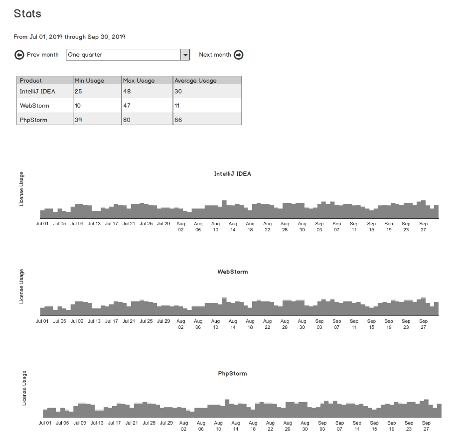

##Задание на летнюю практику в команду FLS

Необходимо сверстать и сделать функциональной страницу со статистикой использования лицензий трёх различных продуктов JetBrains + простой backend для получения данных для отображения на странице.

Диапазоны данных: квартал, месяц, неделя, день.

Требования к странице:

При переключении диапазонов или переходе вперед-назад в рамках одного диапазона должны переключаться данные в таблице и графики. На графиках при наведении на соответствующий столбец должна отображаться подсказка с конкретным значением и периодом.

Скетч показывает примерное расположение блоков, при реализации вы можете использовать любую готовую библиотеку визуальных компонентов или же написать свои собственные. Рабочее разрешение – 1024px, но страница должна адекватно отображаться при меньших (вплоть до 320px) и больших разрешениях (без ограничения).

Единственное обязательное требование к заданию: использование библиотеки React.

Рекомендуется использовать (это означает, что вы можете использовать одно из предложенных решений/библиотек, а можете не использовать или использовать что-то другое, если оно по вашему мнению лучше подходит): Create React App, React Hooks API, react-use, recharts, lodash, dayjs, axios.

Здорово, если вы используете для реализации TypeScript, но JavaScript тоже подойдёт.

При реализации вы можете предложить любые улучшения/изменения как функционала так и UI/UX, но важно чтобы изначальное задание было сделано полностью. Также будьте готовы прокомментировать своё решение.

Backend: Можете использовать любой язык/фреймворк, единственным условием является наличие инструкции по запуску вашего приложения. Данные для отображения на сервере необходимо взять по ссылке.

Тестовые данные вы можете скачать по ссылке. В файле в csv формате хранится timestamp и информация по кол-во использованных лицензий по трём продуктам
